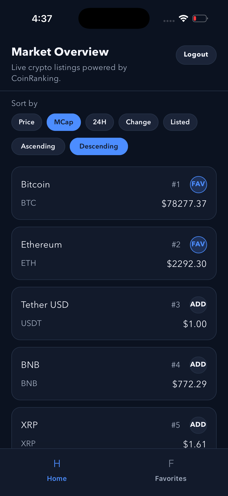
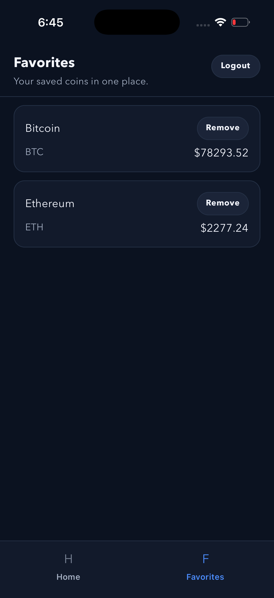
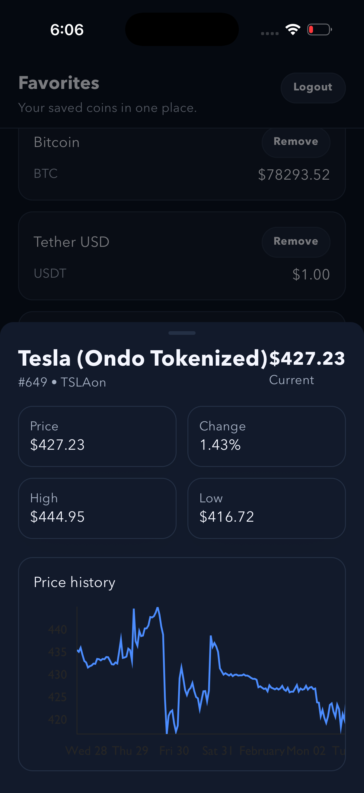
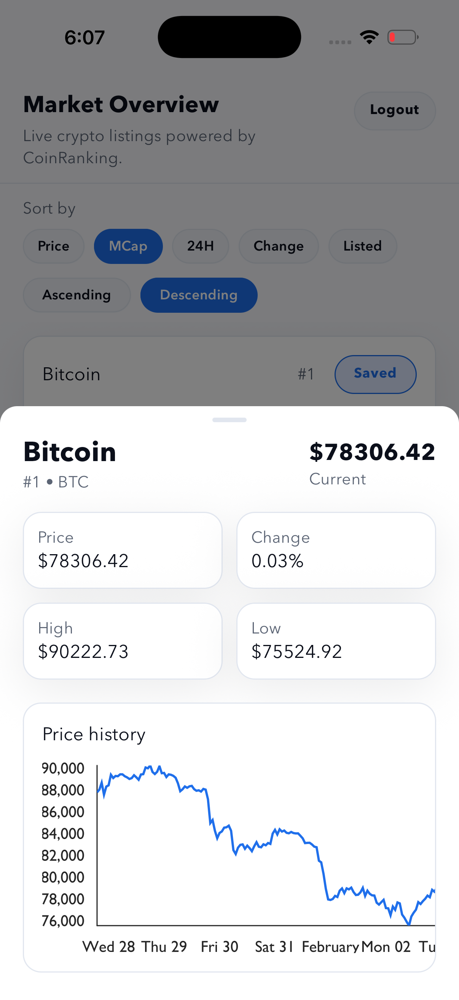
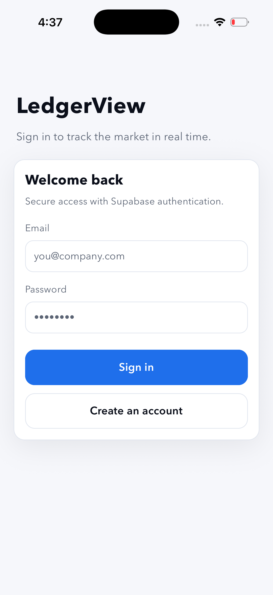
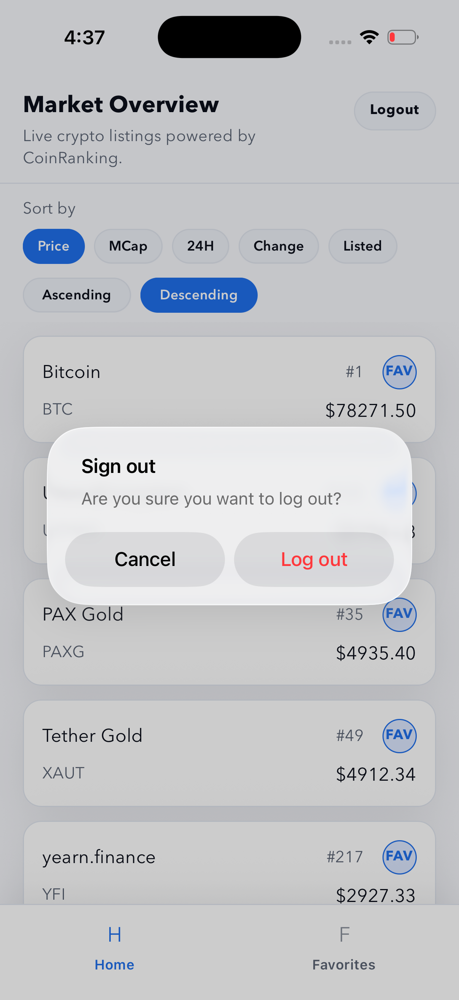

# LedgerView

Professional SaaS-style crypto dashboard powered by CoinRanking and Supabase Auth.

## Screenshots

Add your screenshots to `docs/screenshots/` and update the filenames below.

| Home                                | Favorites                               | Detail                                  |
| ----------------------------------- | --------------------------------------- | --------------------------------------- |
|  |  |  |

| Home                                | SignIn                                 | Logout                                 |
| ----------------------------------- | -------------------------------------- | -------------------------------------- |
|  |  |  |

## Highlights

- Supabase auth with secure session persistence
- CoinRanking market data with sorting + pagination
- Favorites persistence and custom design system
- iOS-style bottom-sheet detail view with history chart

## Tech Stack

- React Native
- Supabase Auth
- CoinRanking API
- @gorhom/bottom-sheet
- Victory Native charts

## Dependencies and Purpose

- `@supabase/supabase-js`: Authentication + session management
- `@gorhom/bottom-sheet`: iOS-style modal bottom sheet
- `victory-native`: Price history chart
- `@react-navigation/*`: Navigation and tabs
- `react-native-config`: Environment variables
- `@react-native-async-storage/async-storage`: Session and favorites persistence

## Environment Setup

Create a `.env` file at the project root:

```env
SUPABASE_URL=https://your-project-id.supabase.co
SUPABASE_ANON_KEY=your-anon-key
COINRANKING_API_KEY=your-coinranking-api-key
```

## Setup

```sh
yarn install

# iOS pods (run when native deps change)
cd ios && pod install && cd ..
```

## Run the App

```sh
# Start Metro
yarn start

# iOS
yarn ios

# Android
yarn android
```

## Testing

Providing unit tests is optional but will earn extra points.

```sh
yarn test

# Coverage
yarn test:coverage
```
